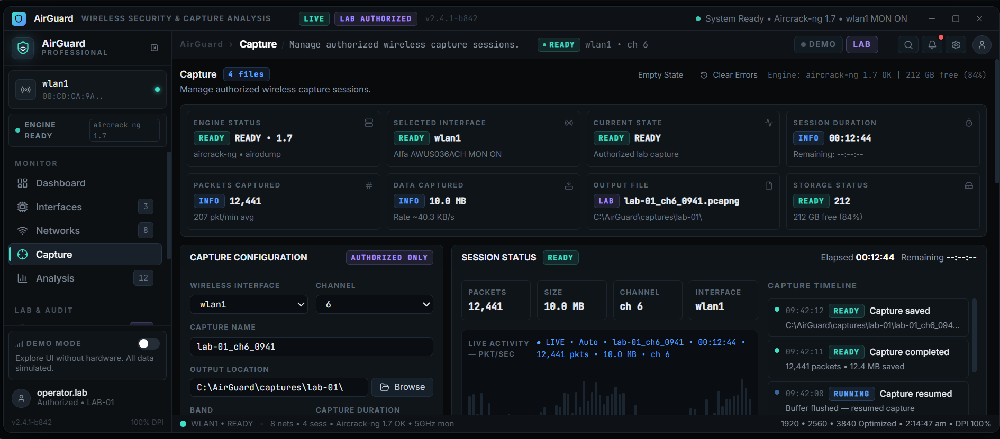

# 🛡️ AirGuard

### Wireless Security & Capture Analysis

<p align="center">
  
</p>

<p align="center">
  <strong>Professional wireless security, capture analysis, network monitoring, and authorized security-lab simulation GUI for Windows.</strong>
</p>

<p align="center">


</p>

---

## ✨ Overview

**AirGuard** is a modern wireless security and capture-analysis interface designed with a professional Windows cybersecurity workflow in mind.

The application provides a centralized interface for:

* Wireless interface monitoring
* Network discovery
* Capture session management
* Capture analysis
* Security event visualization
* Authorized security-lab simulations
* Session management
* Technical logging
* Application configuration
* System and engine status

AirGuard focuses on a **compact, information-dense interface** rather than a generic dashboard or gaming-style cybersecurity UI.

---

## 🖥️ Interface

AirGuard is designed for professional desktop use and optimized for:

* 1920×1080
* 2560×1440
* 3840×2160 (4K)

The interface uses a dark cybersecurity-focused visual system with reusable tables, panels, status indicators, charts, filters, dialogs, and technical information views.

---

## 🚀 Features

### 📊 Dashboard

* System health overview
* Wireless interface status
* Network statistics
* Capture statistics
* Analysis jobs
* Security events
* Session activity
* Recent activity
* Operational charts

### 📡 Interfaces

* Wireless adapter overview
* Interface status
* Driver information
* Channel information
* Signal information
* Interface details
* Interface state monitoring

### 🌐 Networks

* Network discovery interface
* SSID/BSSID information
* Security classification
* Channel and band information
* Signal monitoring
* Client overview
* Search
* Filtering
* Sorting
* Network details

### 📦 Capture

* Capture session management
* Interface selection
* Capture configuration
* Session status
* Capture statistics
* Capture file management
* Capture history
* Progress monitoring

### 🔍 Analysis

* Capture overview
* Network analysis
* Client analysis
* Channel analysis
* Traffic overview
* Security events
* Analysis jobs
* Capture metadata
* Analysis history

### 🧪 Security Lab

AirGuard includes a controlled Security Lab designed for authorized testing and demonstration.

Simulation scenarios include:

* Network Discovery Simulation
* Authentication Event Simulation
* Traffic Analysis Simulation
* Capture Analysis Simulation
* Detection / Alert Simulation

The Security Lab uses synthetic events and fictional data to demonstrate security monitoring and detection workflows.

### 📋 Sessions

* Capture sessions
* Analysis sessions
* Network discovery sessions
* Security Lab sessions
* Session timelines
* Session details
* Session history

### 📝 Logs

* Application logs
* Security events
* Technical events
* Severity filtering
* Source filtering
* Search
* Live log mode
* Log details
* Session correlation

### ⚙️ Settings

* General
* Appearance
* Interfaces
* Capture
* Analysis
* Security Lab
* Notifications
* Storage
* Database
* Engine
* Privacy
* About

---

## 🎭 Demo Mode

AirGuard supports a Demo Mode concept for showcasing the interface without relying on real wireless activity.

Demo Mode can provide fictional:

* Interfaces
* Networks
* Clients
* Capture sessions
* Analysis results
* Security events
* Sessions
* Logs

Simulated information should always be clearly treated as demo data.

---

## 🛡️ Security & Authorized Use

AirGuard is intended for:

* Security research
* Defensive analysis
* Network monitoring
* Wireless diagnostics
* Capture analysis
* Authorized penetration-testing environments
* Controlled laboratory testing
* Security education

### Security Lab Boundary

The Security Lab is simulation-focused and does **not** provide functionality intended for:

* Unauthorized network access
* Credential theft
* Password theft
* Authentication bypass
* Deauthentication
* Wireless disruption
* Rogue access-point attacks
* Malware
* Phishing
* Unauthorized surveillance

Only use AirGuard on networks, devices, and systems that you own or have explicit permission to test.

---

## 🛠️ Technology Stack

| Technology | Purpose                       |
| ---------- | ----------------------------- |
| TypeScript | Application development       |
| React      | User interface                |
| Vite       | Development and build tooling |
| CSS        | UI styling                    |
| Node.js    | Development runtime           |

### Technology


---

## 📥 Installation

### Requirements

Install the following:

* Node.js
* npm
* Git

Check your installation:

```bash
node --version
npm --version
git --version
```

### Clone the Repository

```bash
git clone https://github.com/YOUR-USERNAME/AirGuard.git
```

Enter the project:

```bash
cd AirGuard
```

Install dependencies:

```bash
npm install
```

---

## ▶️ Run AirGuard

Start the development server:

```bash
npm run dev
```

Vite will display a local address similar to:

```text
http://localhost:5173/
```

Open the displayed address in your browser.

---

## 🏗️ Production Build

Create a production build:

```bash
npm run build
```

The compiled application will be generated in:

```text
dist/
```

Preview the production build:

```bash
npm run preview
```

---

## 📁 Project Structure

```text
AirGuard/
│
├── assets/
│   └── airguard-gui.png
│
├── public/
│
├── src/
│   ├── App.tsx
│   ├── App.css
│   ├── index.css
│   └── main.tsx
│
├── package.json
├── package-lock.json
├── tsconfig.json
├── vite.config.ts
└── README.md
```

---

## 🎨 Design Philosophy

AirGuard is designed around:

* Professional cybersecurity aesthetics
* High information density
* Clear visual hierarchy
* Compact desktop layouts
* Minimal unnecessary whitespace
* Technical readability
* Strong system-status visibility
* Consistent reusable components
* 4K desktop usability
* Windows-oriented interaction patterns

The design intentionally avoids excessive neon effects and gaming-style RGB interfaces.

---

## 🖥️ Future Windows Application

The current project is a **React + TypeScript + Vite frontend**.

The planned architecture can evolve into a Windows desktop application:

```text
┌─────────────────────────────┐
│         AirGuard UI         │
│      React + TypeScript     │
└──────────────┬──────────────┘
               │
               ▼
┌─────────────────────────────┐
│      Desktop Runtime        │
└──────────────┬──────────────┘
               │
               ▼
┌─────────────────────────────┐
│     Local Application        │
│        Services              │
├─────────────────────────────┤
│ Interface Services           │
│ Capture Services             │
│ Analysis Services            │
│ Session Management           │
│ Security Lab Simulation      │
└─────────────────────────────┘
```

This allows the visual interface to eventually communicate with local Windows services and authorized wireless-analysis tooling.

---

## 🤝 Contributing

Contributions are welcome.

Before submitting a pull request:

1. Create a feature branch.
2. Make your changes.
3. Test the application.
4. Maintain the existing AirGuard design system.
5. Document significant changes.
6. Submit a pull request.

Example:

```bash
git checkout -b feature/new-feature
```

---

## 📜 License

Choose an appropriate open-source license before publishing the repository.

For example:

**MIT License**

If using MIT, add a `LICENSE` file to the root of the repository.

---

## ⚠️ Disclaimer

AirGuard is a security research and defensive-analysis project.

You are responsible for ensuring that your use of this software complies with all applicable laws, regulations, policies, and authorization requirements.

Only test wireless networks, devices, and systems that you own or have explicit permission to test.

The developers and contributors are not responsible for misuse of this software.

---

## ⭐ Support the Project

If you find AirGuard useful, consider giving the repository a ⭐ on GitHub.

**AirGuard — Wireless Security & Capture Analysis**

Built for authorized security research, defensive analysis, wireless diagnostics, and controlled laboratory environments.
